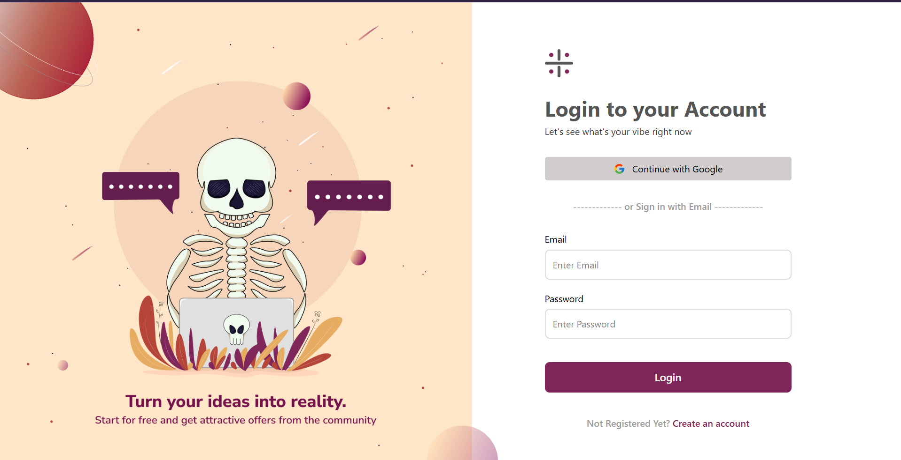
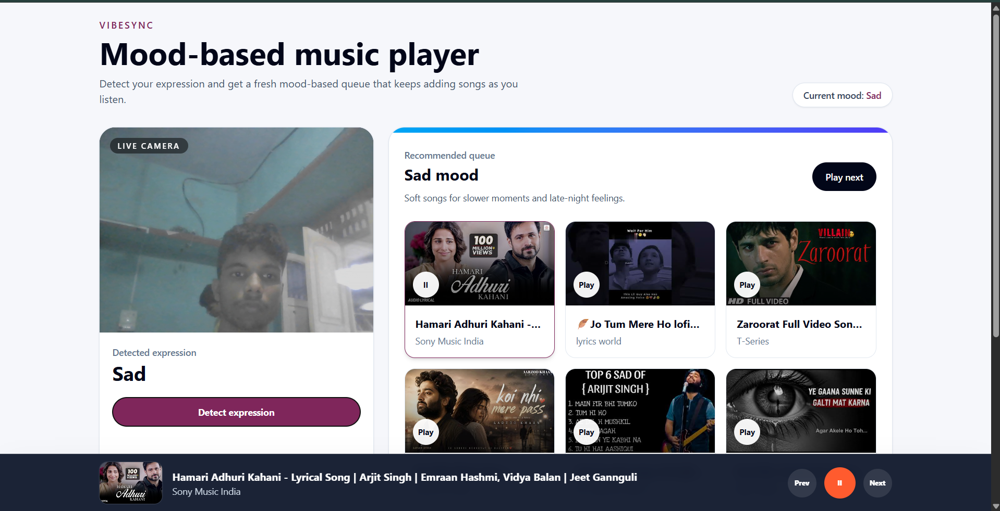
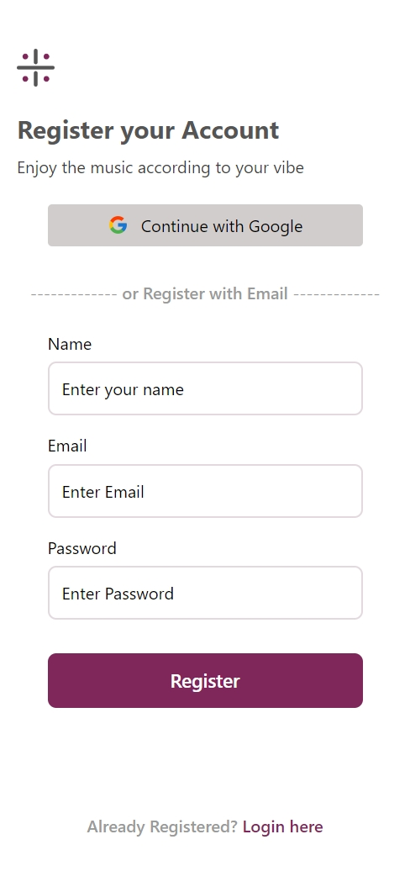
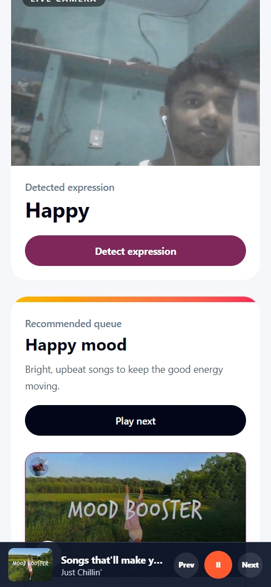

# VibeSync

VibeSync is a full-stack mood-based music web application that detects a user's facial expression and recommends songs that match the current vibe. The app combines authentication, camera-based expression detection, and YouTube-powered music recommendations inside a clean responsive dashboard.

## Live Link

Live demo: https://vibesync-wyr9.onrender.com/

## Screenshots

### Desktop





### Mobile





## Features

- User registration and login with email/password
- Google OAuth login
- JWT authentication with HTTP-only cookies
- Protected dashboard route
- Facial expression detection using MediaPipe
- Mood-based song recommendations
- YouTube song queue with optional endless fetching through the YouTube Data API
- Responsive dashboard for desktop, tablet, and mobile
- Compact bottom music player
- Logout support with token blacklisting through Redis

## Tech Stack

### Frontend

- React 19
- Vite
- React Router
- Redux Toolkit
- React Redux
- Tailwind CSS
- Axios
- MediaPipe Tasks Vision
- YouTube Data API

### Backend

- Node.js
- Express.js
- MongoDB
- Mongoose
- JWT
- Cookie Parser
- Passport.js
- Google OAuth 2.0
- Redis
- ioredis
- Express Validator
- bcryptjs
- Morgan

## Project Structure

```txt
VibeSync/
|-- Backend/
|   |-- server.js
|   `-- src/
|       |-- app.js
|       |-- config/
|       |-- controllers/
|       |-- dao/
|       |-- middleware/
|       |-- models/
|       |-- routes/
|       |-- services/
|       `-- validators/
|-- Frontend/
|   |-- public/
|   |   `-- screenshots/
|   `-- src/
|       |-- app/
|       `-- features/
|           |-- auth/
|           |-- dashboard/
|           `-- expression/
`-- README.md
```

## Getting Started

### 1. Clone the repository

```bash
git clone <your-repository-url>
cd VibeSync
```

### 2. Install backend dependencies

```bash
cd Backend
npm install
```

### 3. Configure backend environment variables

Create a `.env` file inside `Backend/`:

```env
NODE_ENV=development
FRONTEND_URL=http://localhost:5173
PORT = 3000
MONGO_URI=your_mongodb_connection_string
JWT_SECRET=your_jwt_secret
REDIS_HOST=your_redis_host
REDIS_PORT=your_redis_port
REDIS_PASSWORD=your_redis_password
GOOGLE_CLIENT_ID=your_google_client_id
GOOGLE_CLIENT_SECRET=your_google_client_secret
GOOGLE_CALLBACK_URL=http://localhost:3000/api/auth/google/callback
YOUTUBE_API_KEY=your_youtube_api_key
```

### 4. Start the backend

```bash
npm run dev
```

The backend runs on:

```txt
http://localhost:3000
```

### 5. Install frontend dependencies

Open a new terminal:

```bash
cd Frontend
npm install
```

### 6. Configure frontend environment variables

Create a `.env` file inside `Frontend/`:

```env
VITE_YOUTUBE_API_KEY=your_youtube_data_api_key
```

The YouTube API key is optional for fallback songs, but required for endless mood-based recommendations.

### 7. Start the frontend

```bash
npm run dev
```

The frontend runs on:

```txt
http://localhost:5173
```

## How It Works

1. The user registers or logs in.
2. The backend stores the user in MongoDB and sends a JWT inside an HTTP-only cookie.
3. Protected routes verify the authenticated user.
4. The dashboard opens the camera and initializes MediaPipe face detection.
5. When the user clicks `Detect expression`, the app detects a mood such as happy, sad, surprised, or neutral.
6. The dashboard maps that mood to a music search query.
7. The app shows a matching song queue and plays music through a custom bottom player.
8. When the user clicks next near the end of the queue, more songs are fetched based on the same mood.

## API Overview

### Auth Routes

```txt
POST /api/auth/register
POST /api/auth/login
POST /api/auth/logout
GET  /api/auth/get-me
GET  /api/auth/google
GET  /api/auth/google/callback
```

## Notes

- YouTube videos may sometimes fail to play if embedding is disabled, the video is region restricted, or browser autoplay rules block playback.
- The app requests camera permission for expression detection.
- Redis is used to blacklist tokens after logout.
- Google OAuth requires valid credentials from Google Cloud Console.

## Future Improvements

- Add loading skeletons for song fetching
- Add better player controls and progress state
- Add playlist history per user
- Add refresh-token based authentication
- Add tests for backend auth flows
- Add production CORS and cookie configuration
